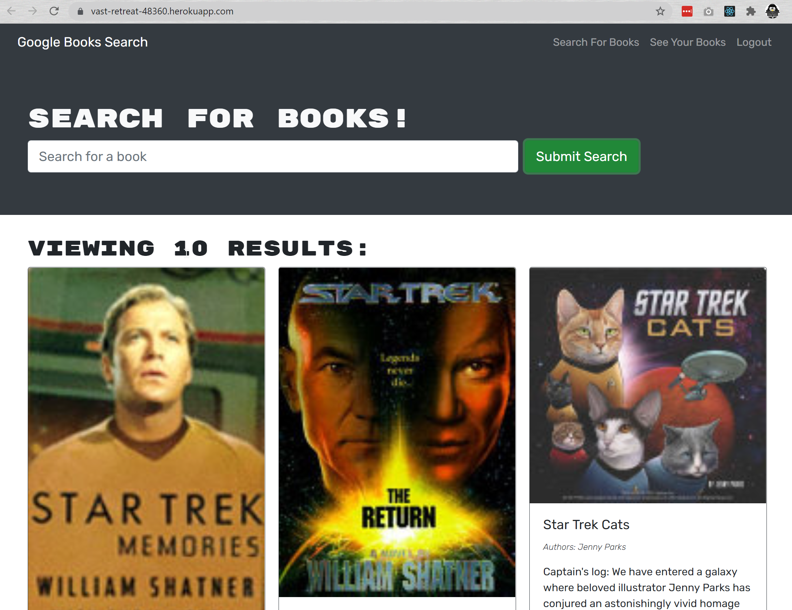

# TITLE: BOOK FINDER  

## Project Function:  
# book-search  
Refactoring RESTful Book Search App to use MERN  

**Creation date:** October 2021  
**Collaborators:** Sheri Elgin  

## Screen Cap  
  

## Project Links  
GitHub Source Code:  https://github.com/grudgecat/book-search   
Heroku link:   https://vast-retreat-48360.herokuapp.com/  

***
## Dependencies   
node.js https://nodejs.org/en/   

package dependencies:  
    "apollo-server-express": "^3.3.0",  
    "bcrypt": "^4.0.1",  
    "express": "^4.17.1",  
    "graphql": "^15.6.0",  
    "jsonwebtoken": "^8.5.1",  
    "mongoose": "^5.9.10"  

